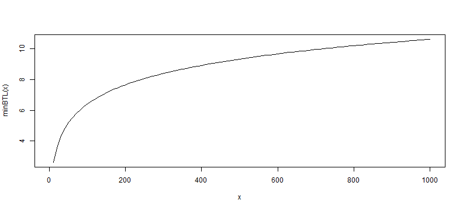

```r
# these are the constants referenced
# Euler–Mascheroni's constant
-digamma(1)
```

```
## [1] 0.5772
```

```r
# euler constant
exp(1)
```

```
## [1] 2.718
```

---

### Expected Maximum Sharpe $E[max_N]$

$$
\begin{aligned}
(1-\gamma)Z^{-1}\left[1-\frac{1}{N}\right]+\gamma Z^{-1}\left[1-\frac{1}{N}e^{-1}\right] \end{aligned}
$$

<h4>R Translation</h4>

```r
### Try to get the right answer for Eq. 4
# if N = 10 paper says 1.57
emax <- function(N) {
  ( ( 1 + digamma(1) ) * qnorm( 1 - 1/N ) ) +  
      (-digamma(1) * qnorm( 1 - (1/N) * exp(-1)))
}

emax(10)  # should be about = 1.57 to match paper
```

```
## [1] 1.575
```


---


```r
#implement upper bound
upbound <- function(N) {sqrt(2*log(N))}
#make a ugly plot for reasonableness check
x11(8,10)
curve(upbound, from = 1, to = 1000, col = "red", lty = 2)
curve(emax, from = 1, to = 1000, add=TRUE)
grid()
```

 


---


```r
### Try next example for Eq. 6
# if y = 5
# so solve for annualized Sharpe of 1
# says no more than 45 N should be tried

# first just do this to make sure I understand
N=45
y=5
emax(N) * y^-0.5  #seemingly understand since close
```

```
## [1] 0.9998
```


--- 
### Minimum Backtest Length (MinBTL)

$$
\begin{aligned}
\left(\frac{(1-\gamma)Z^{-1}\left[1-\frac{1}{N}\right]+\gamma Z^{-1}\left[1-\frac{1}{N}e^{-1}\right]}{\overline{E[max_N]}}\right)^2 \end{aligned}
$$

<h4> R Translation </h4>

```r
#use emax from earlier for numerator
minBTL <- function( N, eMaxSharpe = 1 ) {
  (emax(N) / eMaxSharpe) ^ 2
}
#then this should equal 5 if correct
minBTL( N = 45, eMaxSharpe = 1 )
```

```
## [1] 4.998
```

---


```r
#make ugly plot for a reasonableness check
x11(8,10)
curve( minBTL, from = 1, to = 1000)
```

 

